# Getting Started with arc

> Illustrated version of the [tutorial](tutorial.md) — same steps, with screenshots.
> If you're only editing prose, edit `tutorial.md` and mirror the change here.
>
> Screenshots are scaled down — click any of them to view full size.

## Part 0 — Prerequisites

- macOS (arc currently builds/runs on macOS only)
- Any terminal emulator — iTerm2, Terminal.app, Kitty, Alacritty, WezTerm, VS Code's integrated terminal all detected and supported
- `OPENAI_API_KEY` or `ANTHROPIC_API_KEY` (OpenAI needed for `[vector]` results)
- `pdftotext`
- Ollama: no tool calling — workspace/agent steps need OpenAI or Anthropic

## Part 1 — Install and first launch

```
brew install jrniemiec/arc/arc
arc --version 
```

`arc init` is a guided setup wizard — it creates `~/.arc`, then walks you through LLM providers, ingest pipeline, chat modes, and the optional agent. Re-running it later on an existing config offers to overwrite it.

```
arc init
arc
```

<a href="images/01-init-wizard.png">
  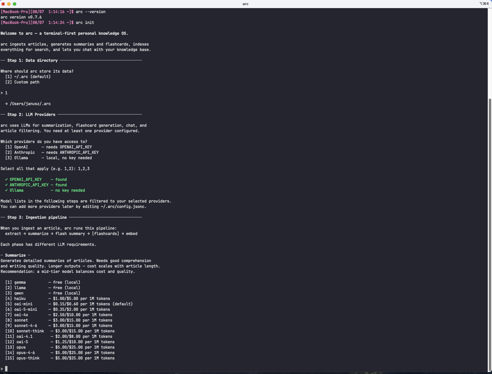
</a>

- `Tab` / `Shift+Tab` — cycle focus: nav → content → open split pane → nav
- `Alt+1` / `Alt+2` / `Alt+3` — jump straight to nav / content / tab bar
- `Esc` — focus the command input; `Esc` again (with input empty) moves focus to nav
- Panes and tabs are also clickable
- Commands start with `/` — type `/` for completions, `/help` to list them
- `?` — bindings for current view
- `/?` — full binding list
- This tutorial is also browsable inside arc — **Help** tab, **Tutorial** sub-tab — or via `arc help tutorial`
- The full TUI and CLI command references live in the same **Help** tab — **TUI Commands**, **TUI Keys**, **CLI Commands** sub-tabs

<a href="images/01-help-tutorial-tab.png">
  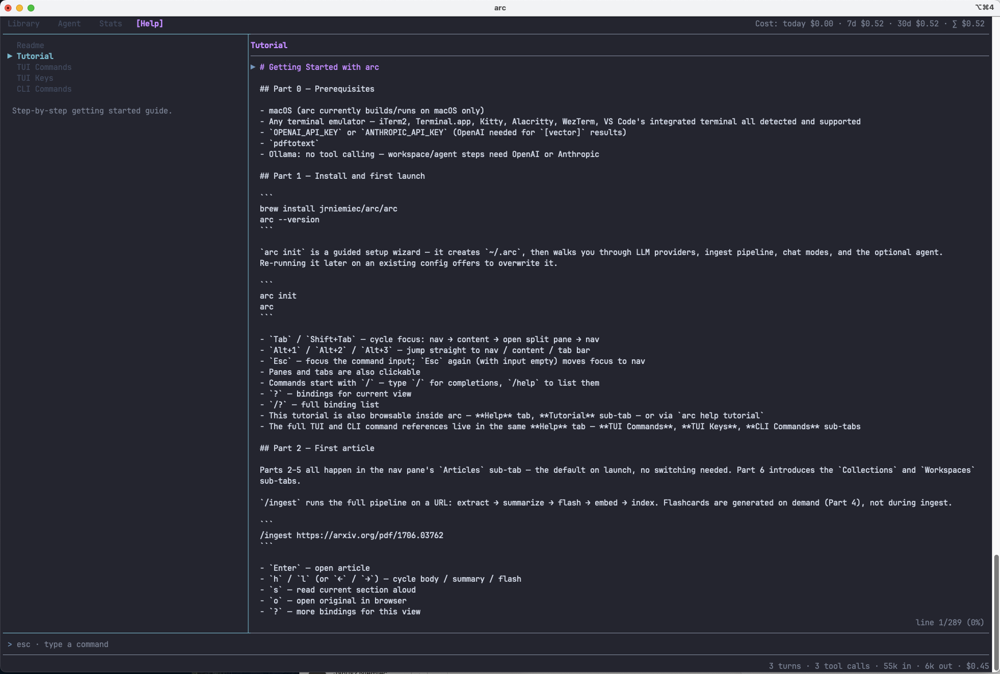
</a>

## Part 2 — First article

Parts 2–5 all happen in the nav pane's `Articles` sub-tab — the default on launch, no switching needed. Part 6 introduces the `Collections` and `Workspaces` sub-tabs.

<a href="images/02-empty-library.png">
  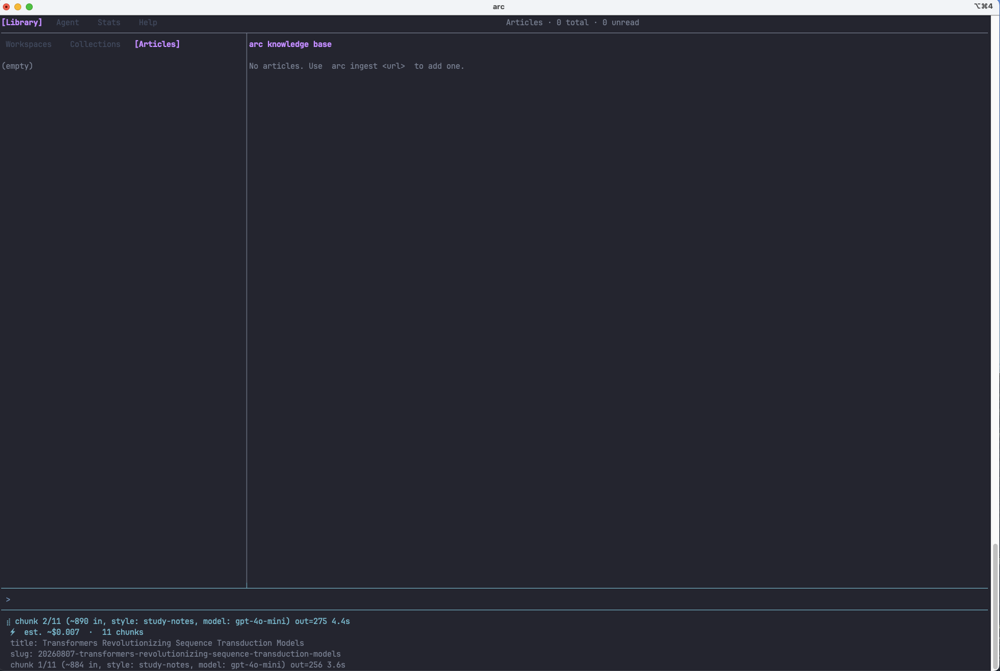
</a>

`/ingest` runs the full pipeline on a URL: extract → summarize → flash → embed → index. Flashcards are generated on demand (Part 4), not during ingest.

```
/ingest https://arxiv.org/pdf/1706.03762
```

<a href="images/02-article-flash-summary.png">
  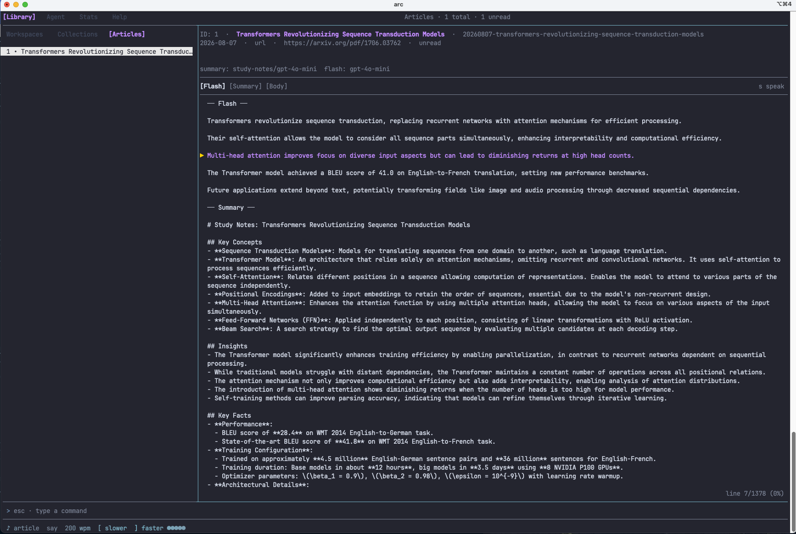
</a>

- `Enter` — open article
- `h` / `l` (or `←` / `→`) — cycle body / summary / flash
- `s` — read current section aloud
- `o` — open original in browser
- `?` — more bindings for this view

## Part 3 — Build the library

Ingest a few more articles to give the library something to organize and search across:

```
/ingest https://jalammar.github.io/illustrated-transformer/
/ingest https://nlp.seas.harvard.edu/annotated-transformer/
/ingest https://lilianweng.github.io/posts/2023-01-27-the-transformer-family-v2/
/ingest https://transformer-circuits.pub/2021/framework/index.html
```

<a href="images/03-library-favorite-read.png">
  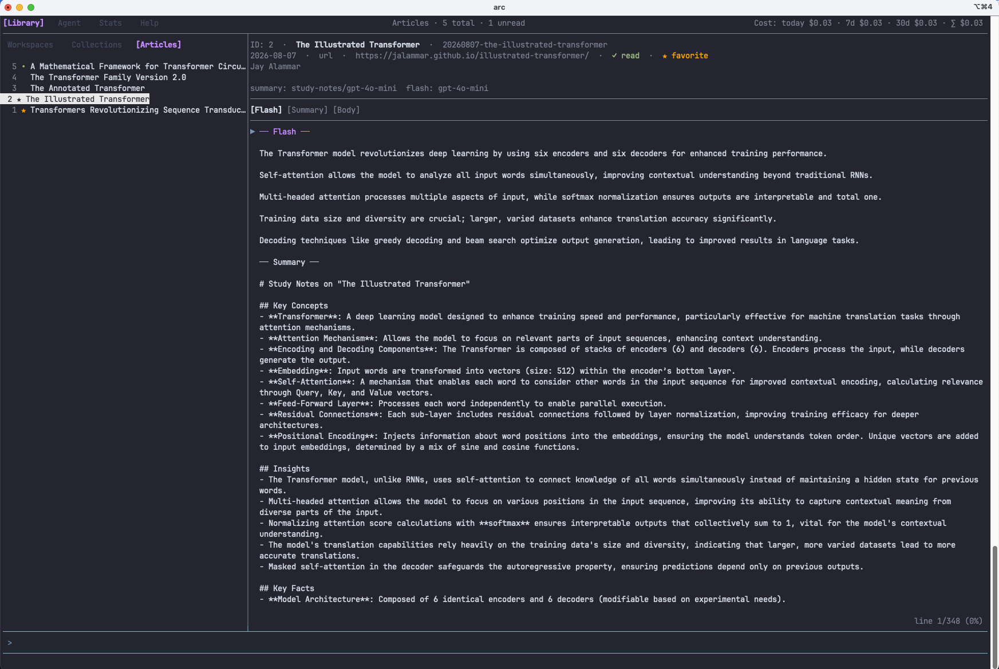
</a>

- `j` / `k` (or `↓` / `↑`) — navigate
- `f` — favorite
- `r` — mark read
- `?` — more bindings for this view

## Part 4 — What one article gives you

- `c` — article chat: grounded on this article only (summary, no cross-article search or web tools); history persists per article

Inside the chat, `/model <name>` switches the model; everything else you type is a plain chat query, not a command:

<a href="images/04-model-picker.png">
  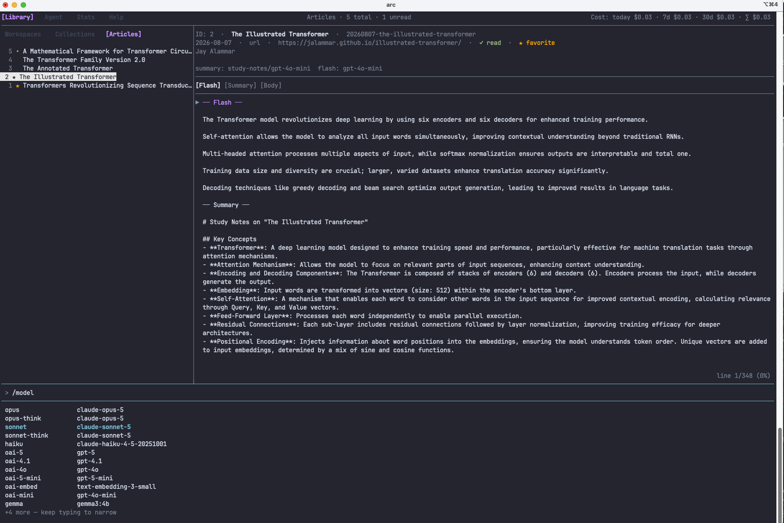
</a>

```
/model sonnet
The article says the encoder-decoder attention layer works differently from the self-attention layers. What's the difference?
Walk me through what happens to a single word as it moves through one encoder layer.
```

<a href="images/04-article-chat.png">
  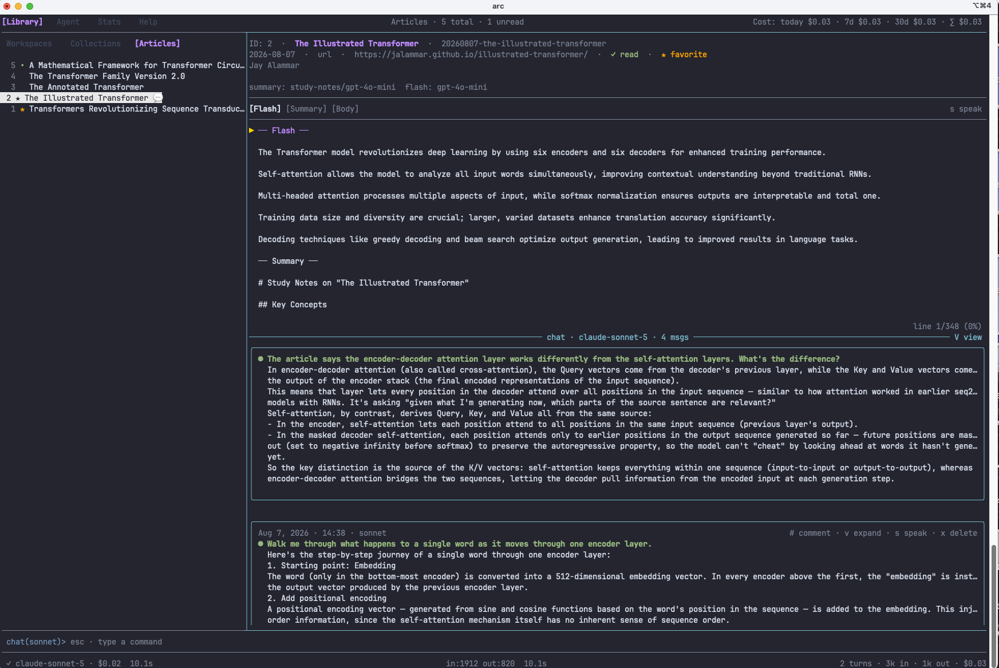
</a>

- `s` — speak the selected exchange aloud
- `v` — fold/unfold the selected exchange

```
/flashcards
```

<a href="images/04-flashcards.png">
  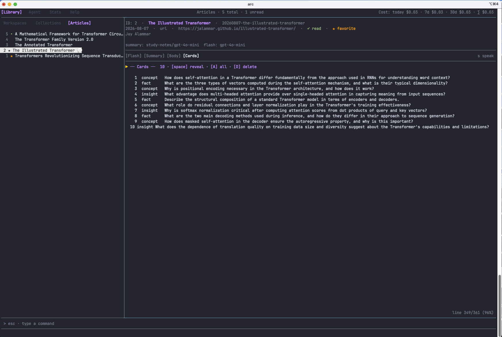
</a>

- `[Cards]` tab — questions visible, answers hidden
- `space` — reveal one answer
- `A` — reveal all / collapse
- `?` — more bindings for this view

<a href="images/04-flashcards-answers.png">
  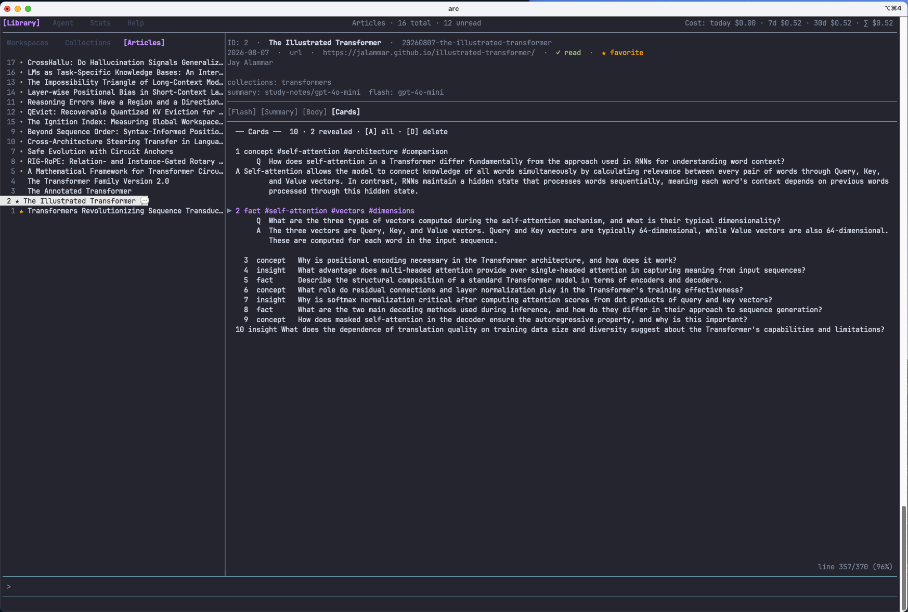
</a>

## Part 5 — Search across the library

```
/search positional encoding
```

<a href="images/05-search-fts-and-vector.png">
  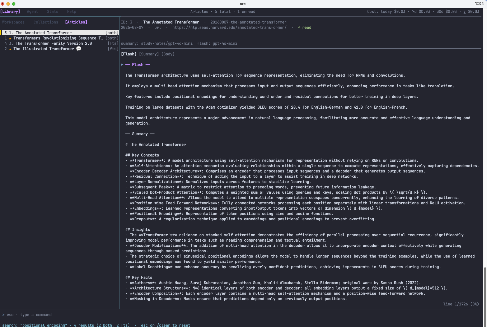
</a>

```
/search why do models forget earlier tokens
```

<a href="images/05-search-vector.png">
  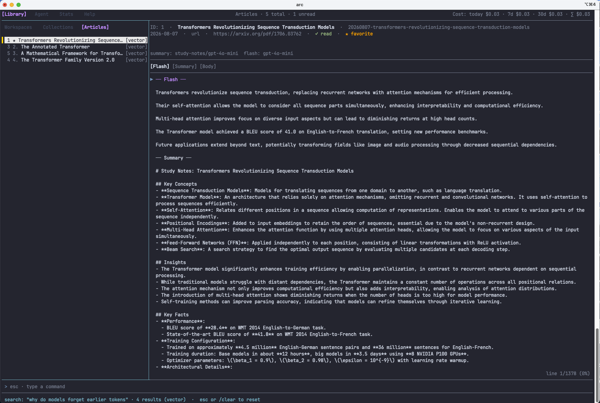
</a>

- Badges: `[fts]` keyword, `[vector]` semantic, `[both]`

## Part 6 — Organize

Create the collection — **Collections** sub-tab:

```
/new transformers "Transformer internals — attention, positional encoding, interpretability - from the original attention mechanism to modern variants."
```

- `/new <slug> [description]` — description matters: it's what `arc collections assign` matches article titles against later
- CLI equivalent: `arc collections create <slug>`

<a href="images/06-collection-created.png">
  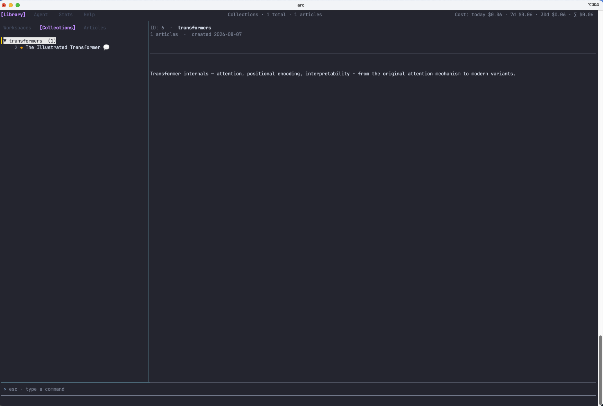
</a>

Add articles — **Articles** sub-tab, cursor on the article:

```
/collection-add transformers
```

<a href="images/06-collection-add.png">
  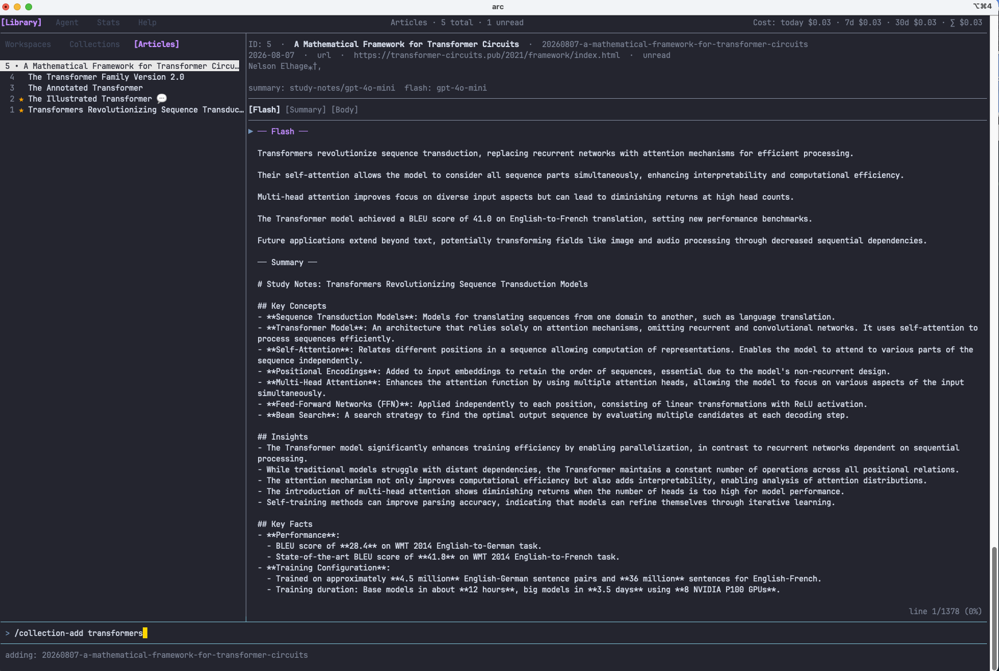
</a>

- One article per invocation; the article is the selected row
- Picker shows `adding: <article-slug>` above the collection list
- `/collection-remove transformers` — reverse, same context

Remove from the **Collections** sub-tab, cursor on the article inside the collection:

- `U` — remove it from that collection
- `/article-remove [<article-slug>]` — same, defaults to the selected row

Bulk-fill one collection with AI — CLI (description already set at creation above):

```
arc collections assign transformers
arc collections assign transformers --apply
```

<a href="images/06-cli-collections-assign.png">
  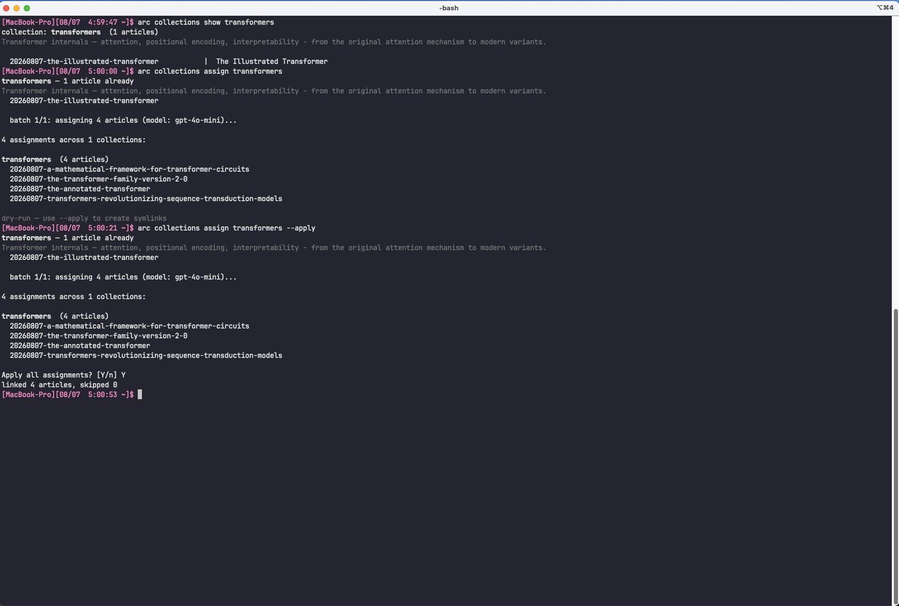
</a>

- Dry-run by default; prints current members (capped at 10), then the proposals
- Considers every article not already a member — `--limit N` / `--uncollected-fresh` narrow it
- `arc collections show transformers` — members and description

<a href="images/06-collection-filled.png">
  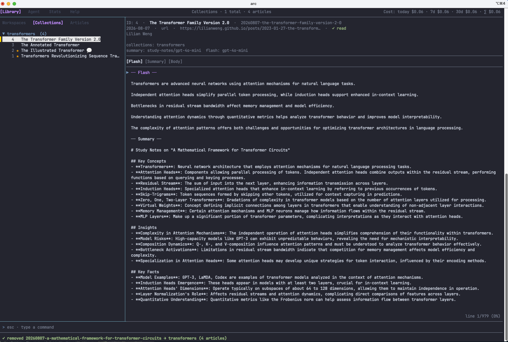
</a>

Whole library at once:

```
arc collections assign                # spread uncollected articles across all collections
arc collections suggest               # propose new collections to create
arc collections suggest --uncollected # per-article, reads flash summaries
```

## Part 7 — Workspace

```
/workspace new transformers
```

Attach an article — **Workspaces** sub-tab, cursor on the workspace:

```
/article-add <article-slug>
```

- Tab-complete the slug from your ingested articles

Attach the collection — same context:

```
/collection-add transformers
```

Attach a non-article resource (notes file) — same context:

```
/resource-add ~/notes/transformer-questions.md
```

- `/resource-add <path|url> [--into <dir>] [--as <name>] [--comment "..."]` — copies a file/dir, or fetches a URL, into `workspace/resources/`

## Part 8 — Configure the workspace chat

Selecting the workspace in the **Workspaces** sub-tab puts you in its chat automatically — no keypress needed, unlike article chat's `c`. The command input is now the chat input.

```
/model opus
```

<a href="images/08-model-switch.png">
  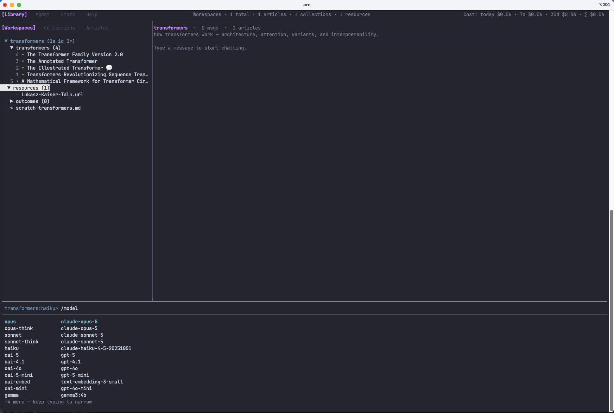
</a>

```
/mode open
```

<a href="images/08-mode-switch.png">
  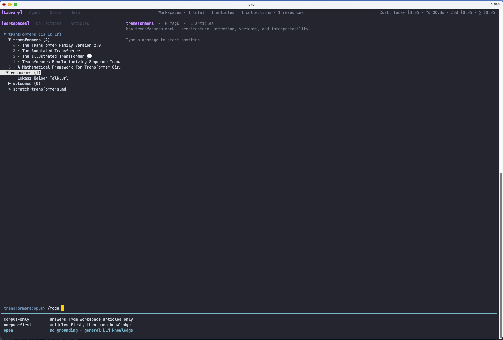
</a>

- `/model opus` — switches the model; persists to this workspace, applies on the next message
- `/mode open` — grounding: web search enabled (Anthropic only)
- Grounding alternatives: `corpus-only`, `corpus-first` (default)

## Part 9 — The payoff

Start the workspace conversation:

```
Compare how the original Transformer paper and the annotated Transformer implementation handle positional encoding.
What have people published on transformer architecture variants since 2024?
```

<a href="images/09-payoff-chat.png">
  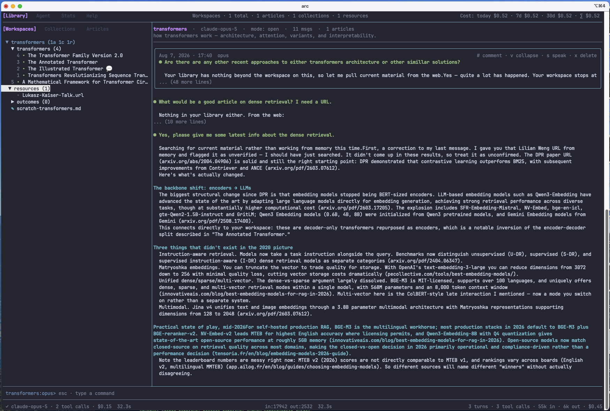
</a>

- First question spans multiple articles → `search_articles` tool call
- Second needs current information → web search via `open` grounding

Clean up and preserve the conversation — cursor on an exchange in the chat pane:

- `x` — delete the selected exchange
- `#` — comment out the selected exchange (excluded from the model's context, stays visible) — the closest thing to "turn into a note"; not the same as a `//`-prefixed note, which adds a new annotation rather than converting an existing message
- `/outcome-save [name]` — save the conversation to `workspace/outcomes/` (defaults to a timestamped filename)

<a href="images/09-outcome-saved.png">
  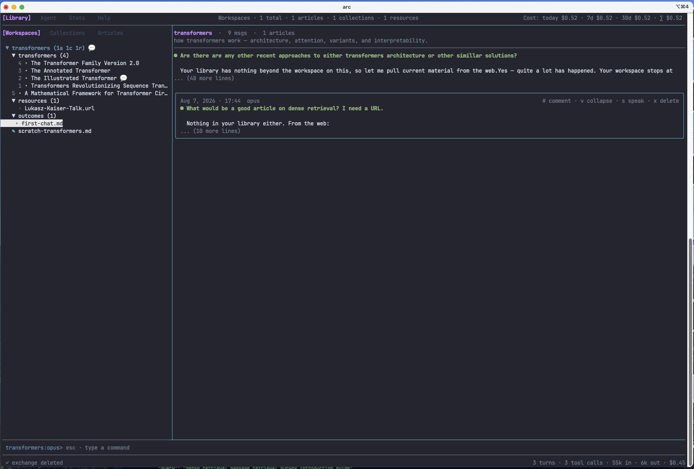
</a>

## Part 10 — Optional: the agent

The agent polls the feeds you configure, uses an LLM to filter each item against your interest profile, and ingests what's relevant — unattended library growth instead of manual `/ingest`.

Create a feed — **Agent** tab, **Feeds** sub-tab:

```
/feed-add
```

Opens `$EDITOR` with a JSON template; fill it in and save:

```json
{
  "name": "arXiv cs.CL",
  "url": "https://rss.arxiv.org/rss/cs.CL",
  "filter": "only papers about transformer architecture, attention mechanisms, or LLM internals",
  "tags": [],
  "disabled": false
}
```

<a href="images/10-feed-add.png">
  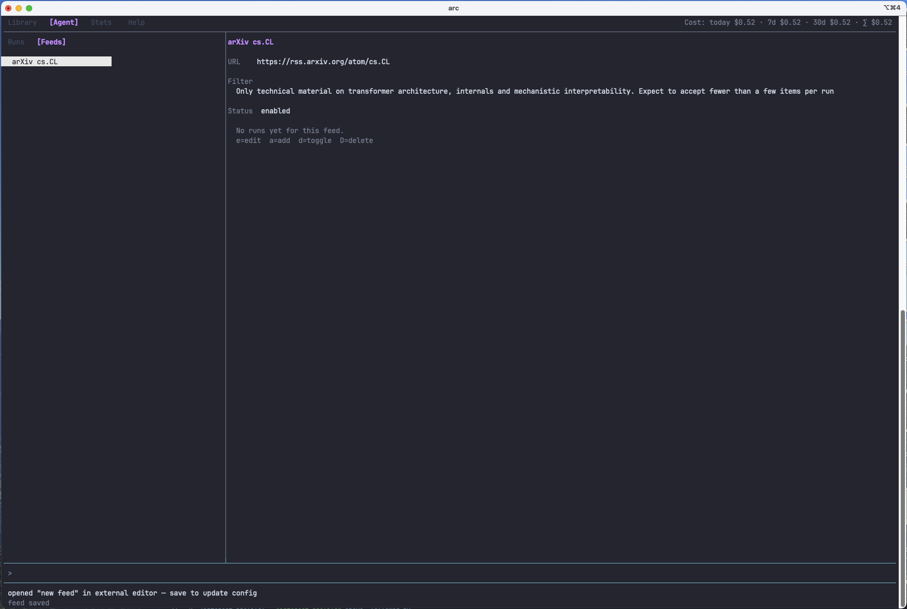
</a>

Run it for real — **Runs** sub-tab:

```
/agent-run
```

<a href="images/10-agent-run-confirm.png">
  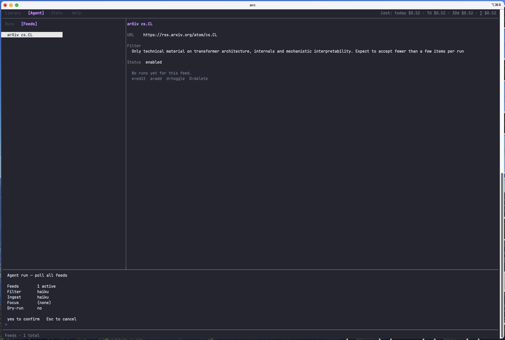
</a>

- Relevant items are ingested immediately; skipped items are left `pending` so you can act on them
- Cursor on a pending item: `a` accept, `s` re-skip — the LLM's filter reasoning is shown under each item
- `--dry-run` previews decisions without ingesting anything, but leaves nothing to accept/skip against — use the real run to get operable items

<a href="images/10-agent-run-results.png">
  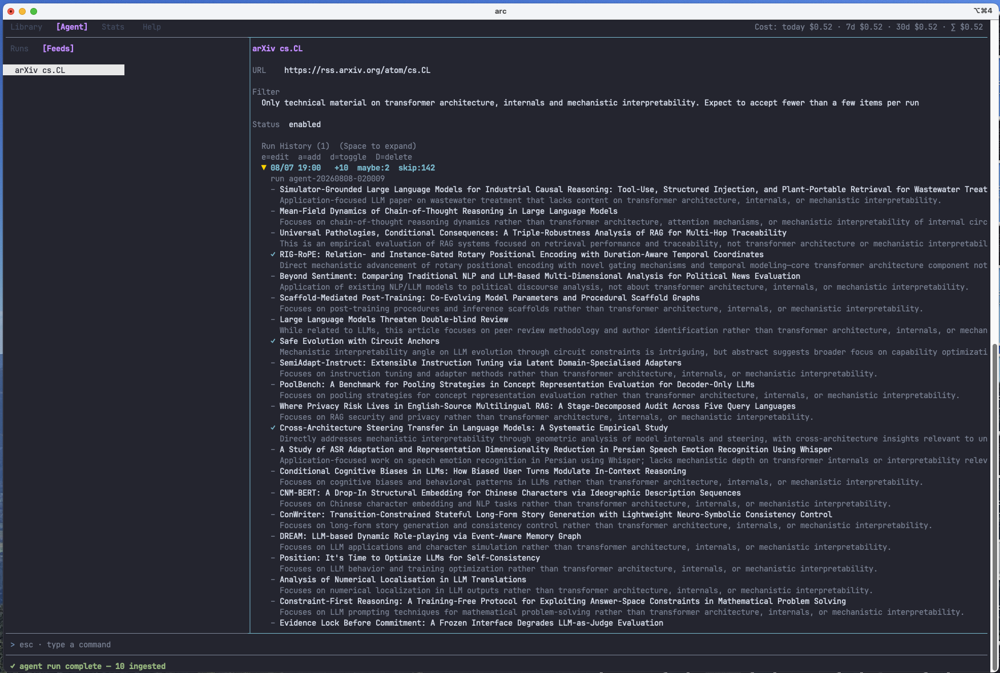
</a>

Ingest anything you flipped to accept:

```
/agent-rerun
```

- `/agent-rerun` ingests everything left marked `+` from the selected run
- `/agent-run` (no flags) does a fresh poll-and-ingest in one shot, skipping the review step

Schedule it — CLI, outside the TUI:

```
# crontab: run the feed agent every morning at 7
0 7 * * * /usr/local/bin/arc agent run
```

## Part 11 — Batch and automation (CLI)

Every operation above has a CLI equivalent — scriptable, no TUI required. A few are CLI-only, being bulk or pipeline-shaped:

```
arc ingest --file reading-list.txt
arc extract <url> | arc summarize --style bullets
arc list --json | jq '.[] | select(.unread) | .title'
arc embed --dry-run
```

Browse and read without the TUI:

```
arc list --unread
arc read 20260807-the-annotated-transformer --summary
```

Regenerate an article after an edit, a source refetch, or a prompt change:

```
arc reprocess 20260807-the-annotated-transformer --clean
arc reprocess --collection transformers
arc reprocess --all --refetch
```

Mail yourself what the agent found — pipe to any mailer, `msmtp` here, already installed and configured with SMTP credentials:

```
arc agent digest | msmtp you@example.com
```

TTS voice and rate — `~/.arc/config.jsonc`:

```json
{ "tts_voice": "Samantha", "tts_rate": 200 }
```
